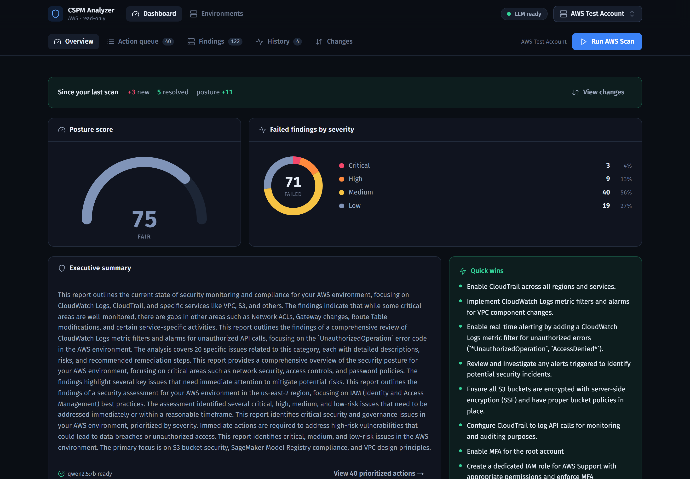
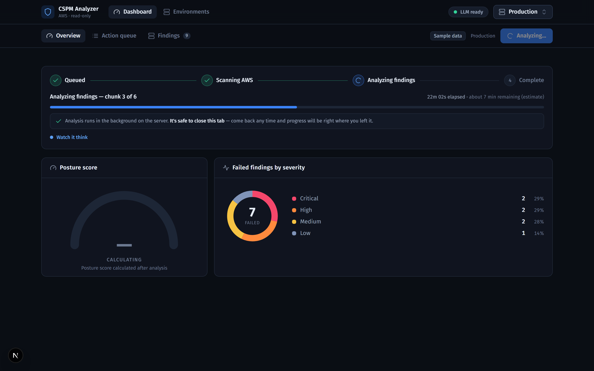
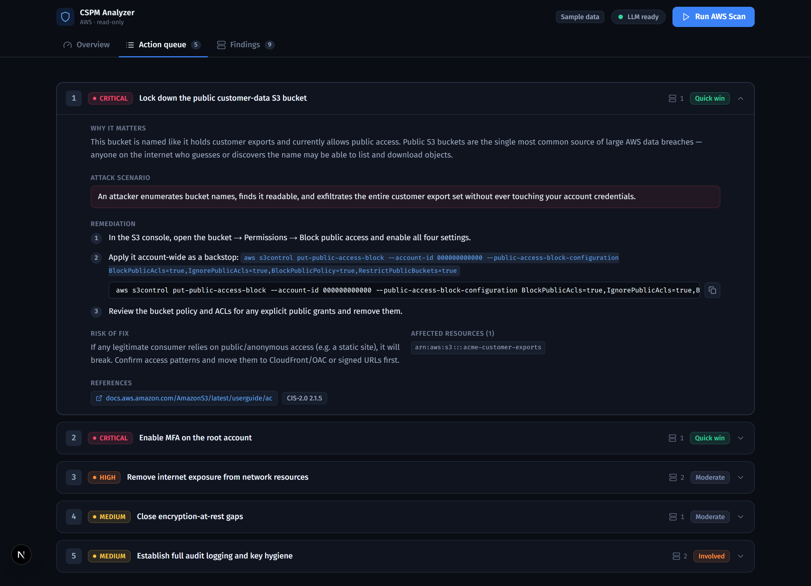
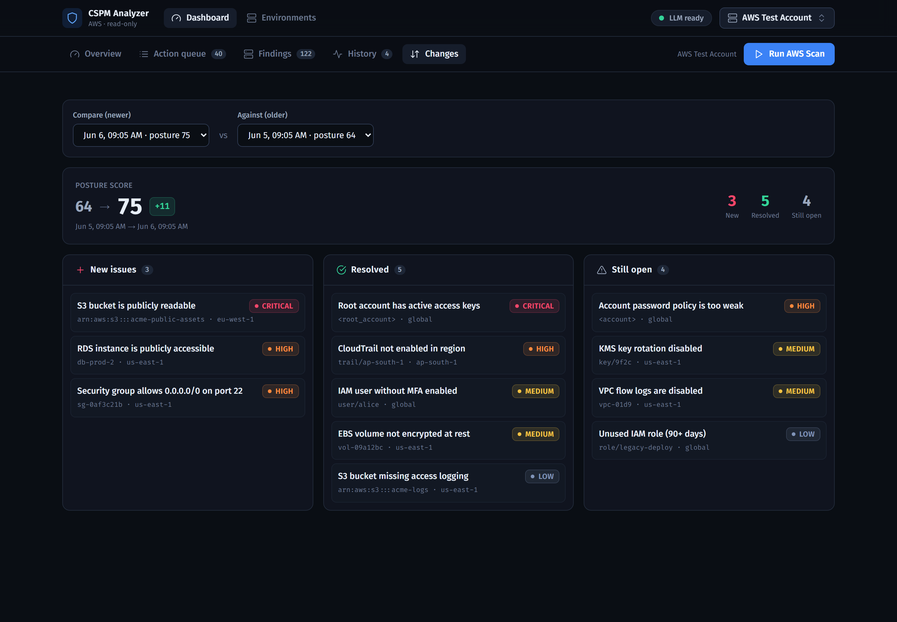
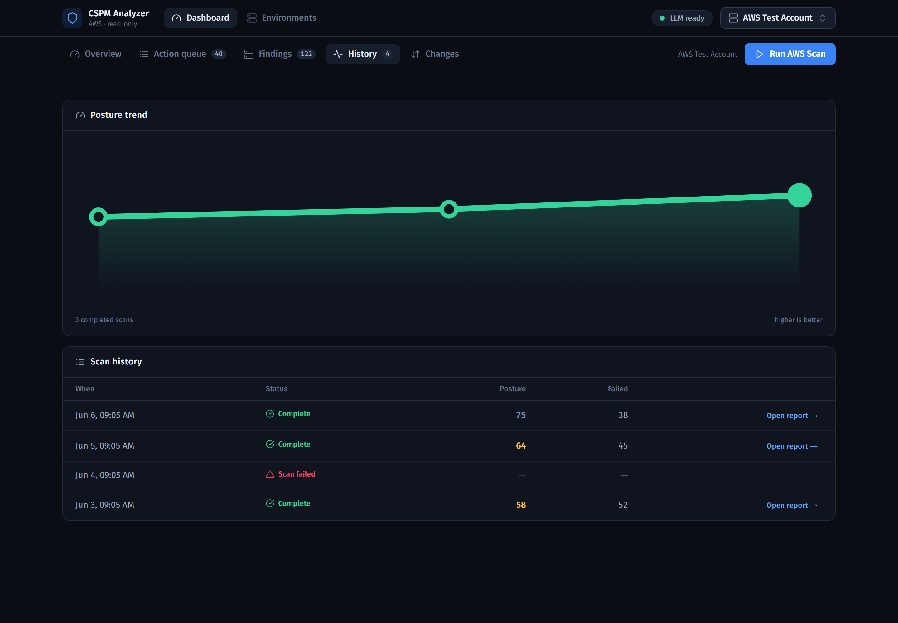
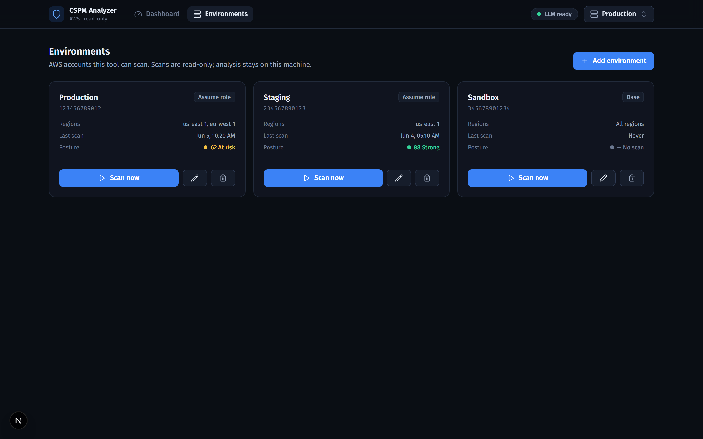
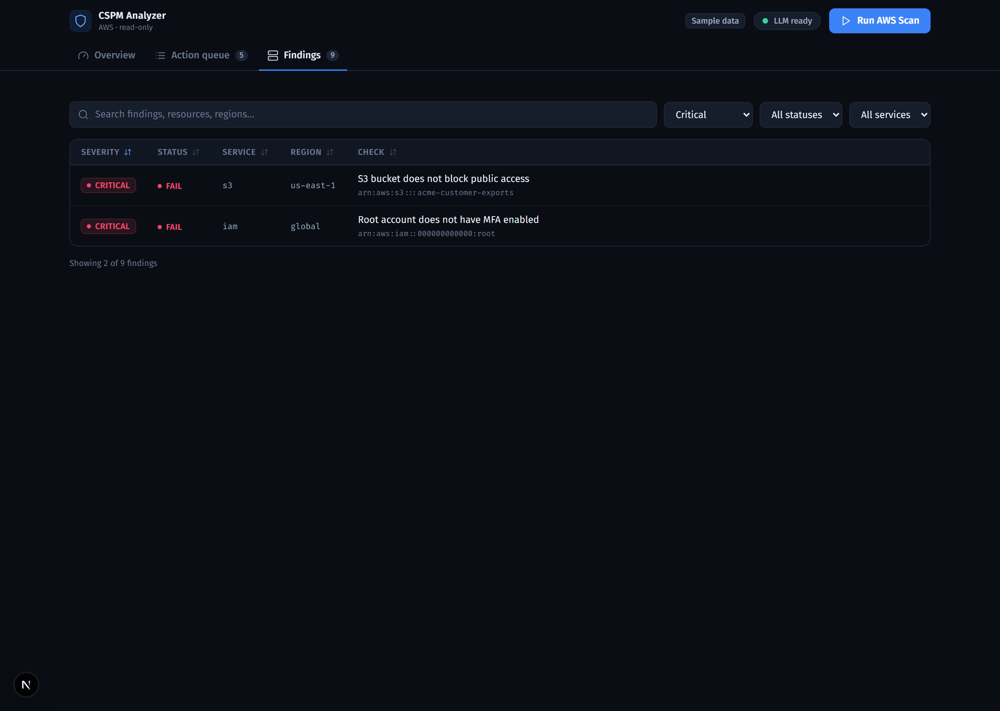
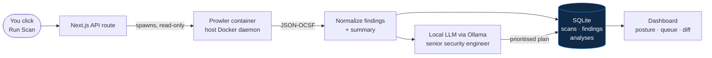

<div align="center">


# Parapet

### Your vantage point on cloud security

**Parapet** is an agentic Cloud Security Posture Management (CSPM) tool for AWS. [Prowler](https://github.com/prowler-cloud/prowler) scans your account read-only, a **local** LLM via [Ollama](https://ollama.com/) acts as a senior cloud-security engineer — explaining every finding in plain language, re-prioritising by real-world risk, and producing a streamlined remediation plan — and a modern Next.js dashboard ties it all together.

Everything runs locally in Docker Desktop. **No findings data ever leaves your machine, and the tool never modifies cloud resources.**

[](LICENSE)
[](https://nextjs.org/)
[](https://github.com/prowler-cloud/prowler)
[-44cc88)](https://ollama.com/)
[](SECURITY.md)
[](https://www.typescriptlang.org/)

</div>

<div align="center">
  
</div>

---

## Why Parapet

A raw Prowler scan can return dozens or hundreds of findings — a flat, noisy list with no sense of what actually matters. Parapet turns that list into a decision.

A local LLM reads every finding and acts as a senior cloud-security engineer: it **re-prioritises by real-world risk** (internet exposure, blast radius, privilege-escalation potential) rather than by Prowler's raw severity label, **groups related findings**, explains each in plain language with a concrete attack scenario, and writes ordered remediation steps with copy-paste CLI commands. Because the model runs locally via Ollama, your findings never leave the machine.

| | |
|---|---|
| 🛡️ **Read-only by design** | No AWS SDK is even a dependency. Scanning is delegated entirely to the read-only Prowler container — there is no code path that can modify a cloud resource. |
| 🧠 **Local LLM analysis** | A local model (Ollama) reads the findings and produces a prioritised remediation plan. Nothing is sent to a third-party API. |
| 🔑 **Assume-role, multi-environment** | Register multiple AWS accounts in the UI via cross-account IAM roles. The database stores role ARNs — **never secret keys**. |
| 📈 **History & diffing** | Every scan is persisted. See posture trend over time and a scan-to-scan diff: what's **new**, **resolved**, and **still open**. |
| ⏳ **Resilient async pipeline** | Analysis runs as a background job that survives tab closes, shows live chunk-by-chunk progress, and produces a partial report rather than failing if a chunk errors. |
| 🎨 **Modern SOC dashboard** | Dark, accessible, security-operations UI with a posture gauge, severity charts, a prioritised action queue, and a filterable findings table. |

---

## Screenshots

<table>
  <tr>
    <td width="50%"><br/><sub><b>Async analysis</b> — live chunk progress, safe to close the tab</sub></td>
    <td width="50%"><br/><sub><b>Action queue</b> — reprioritised items with remediation steps</sub></td>
  </tr>
  <tr>
    <td width="50%"><br/><sub><b>Diff</b> — new / resolved / still-open between scans</sub></td>
    <td width="50%"><br/><sub><b>History</b> — posture trend across scans</sub></td>
  </tr>
  <tr>
    <td width="50%"><br/><sub><b>Environments</b> — multi-account via assume-role</sub></td>
    <td width="50%"><br/><sub><b>Findings</b> — the trust-but-verify view</sub></td>
  </tr>
</table>

---

## How it works



1. **Scan** — `POST /api/scan` runs Prowler on the host Docker daemon in read-only mode and writes a JSON-OCSF report.
2. **Normalize** — the raw OCSF output is validated and normalised into a clean `Finding[]` + severity/service summary.
3. **Analyze** — a background job streams the findings to the local LLM, which returns a structured, prioritised remediation report (persisted to SQLite).
4. **Present** — the dashboard renders the posture score, severity breakdown, prioritised action queue, raw findings, history trend, and scan-to-scan diff.

For assume-role scanning, Prowler performs the STS `AssumeRole` itself — so the app stays AWS-SDK-free and the database never holds an AWS secret.

---

## Quick start

> **Prerequisites:** [Docker Desktop](https://www.docker.com/products/docker-desktop/) running, read-only AWS credentials (see [AWS setup](docs/AWS_SETUP.md)), and ~6 GB free disk for the LLM and Prowler images.

### One-command setup

**macOS / Linux**

```bash
git clone https://github.com/<your-username>/parapet-cspm.git
cd parapet-cspm
./install.sh
```

**Windows (PowerShell)**

```powershell
git clone https://github.com/<your-username>/parapet-cspm.git
cd parapet-cspm
./install.ps1
```

The installer checks Docker, creates your `.env`, brings up the stack, pulls the LLM model, and waits until everything is healthy. Then open **http://localhost:3000**.

### Manual setup

```bash
cp .env.example .env          # add your read-only AWS keys; on Windows set HOST_SCANS_DIR
docker compose up -d --build
docker compose exec ollama ollama pull qwen2.5:7b   # one-time model pull
# open http://localhost:3000
```

Full details, environment variables, and troubleshooting are in the **[Deployment Guide](DEPLOYMENT.md)**.

---

## AWS setup

Parapet needs **read-only** access. The recommended setup uses the AWS-managed `SecurityAudit` + `ViewOnlyAccess` policies — neither grants any create/update/delete permission, so the credentials cannot modify resources even if misused.

Two supported models:

- **IAM access keys** — simplest; drop read-only keys in `.env`.
- **Assume-role (recommended)** — register a cross-account read-only role in the UI; nothing secret is stored.

Step-by-step console + CLI instructions, helper scripts, and an optional "deliberately-misconfigured sandbox" to test against are in the **[AWS Setup Guide](docs/AWS_SETUP.md)**.

---

## Tech stack

| Layer | Technology |
|---|---|
| Scanner | [Prowler](https://github.com/prowler-cloud/prowler) (`prowlercloud/prowler`), JSON-OCSF output |
| LLM | [Ollama](https://ollama.com/) (local), OpenAI-compatible API — default `qwen2.5:7b` |
| App | [Next.js 16](https://nextjs.org/) (App Router, TypeScript strict), React 19 |
| Persistence | SQLite via [Drizzle ORM](https://orm.drizzle.team/) + better-sqlite3 |
| UI | Tailwind CSS v4, dark SOC dashboard, accessible (WCAG AA) |
| Orchestration | Docker Compose (Docker Desktop) |

---

## Security

- **Read-only.** The app never mutates cloud resources; scanning is delegated to the read-only Prowler container.
- **Local-first.** The LLM runs locally — findings never leave the machine.
- **Secrets stay server-side.** AWS credentials are read only in server-side code (`import "server-only"` tripwires) and never reach the browser bundle.
- **Docker socket tradeoff.** `web` mounts `/var/run/docker.sock` to spawn Prowler on the host daemon — acceptable for a **local, single-user** tool, **not** for shared/multi-tenant/internet-exposed deployments.

The full credential model, least-privilege policy, assume-role setup, and the socket-mount tradeoff are documented in **[SECURITY.md](SECURITY.md)**.

---

## Development (without Docker)

```bash
npm install
npm run dev          # http://localhost:3000
npm test             # unit tests (Node's built-in runner)
npm run typecheck    # tsc --noEmit
npm run lint
npm run check:ollama # requires a local `ollama serve` on :11434
```

---

## Roadmap

- **Attack-path simulation** — model the account as a graph and surface toxic combinations (public compute → over-privileged role → sensitive data), grounded in real relationship data and narrated by the LLM.
- **Scheduled scans** — recurring scans with "email me what changed since last week," built on the existing diff engine.
- **Multi-cloud** — Azure and GCP (Prowler already supports both).

---

## License

[Apache License 2.0](LICENSE) © 2026 Moiz Lakdawala.

Built on the excellent open-source work of [Prowler](https://github.com/prowler-cloud/prowler) and [Ollama](https://ollama.com/).
